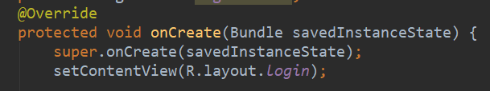
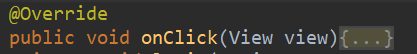

## Notes of learning Andriod project

前几日对FIT进行了一些基础开发，但是由于对代码结构理解不清晰所以效率还是比较低。于是技术风险还是存在。今天对一些知识点进行整理，希望能够帮到之后的开发。

### 四大组件
Android有四大组件：Activity，Service，Content Provider，Broadcast Receiver

#### Activity

一个 Activity 用于展示一屏的内容，所以所有要展示内容的屏幕都要继承 Activity 才能实现。


接着覆盖了 onCreate() 方法对该 Activity 进行初始化 。

setContentView(R.layout. *main* )设置了使用 main.xml 这个布局文件作为当前 Activity 的内容展示

 

Activity有不同状态：

**运行状态**：当Activity处于屏幕最前端，此时Activity完全显示在用户的界面中，并能获取焦点时,可以响应用户的的触摸屏幕等事件，此时为运行状态。

**暂停状态**：当Activity被其他Activity遮挡，但是仍然有部分可见，此时为暂停状态；当处于暂停状态时，Activity仍然会更新UI，但是此时不能获取焦点，即不会响应用户触摸、后退等事件。

**停止状态**：当Activity被另外一个Activity完全遮挡，此时为停止状态，停止状态并不意味着Activity停止运行，而可以理解为转入后台运行。

打开一个Activity的时候，其周期方法执行顺序详情下图所示


#### Service

比如播放的音乐，还可以后台播放打开其他程序。

跟Activity的级别差不多，但不能自己运行，只能后台运行，并且可以和其他组件进行交互。Service是没有界面的长生命周期的代码。Service是一种程序，可以运行很长时间，但是没有用户界面。

需要通过调用Context.startService()或Context.bindService()方法启动服务。这两个方法都可以启动Service，但是使用场合有所不同。

由于我们目前还没有功能需求，就先略过这一块。

#### Content Provider

Android系统提供了诸如：音频、视频、图片、通讯录等主要数据类型的Content Provider。我们也可以创建自己的Content Provider。

它是Android系统提供的在多个应用之间共享数据的一种机制。一个Content Provider类实现了一组标准的方法接口，从而能够让其他的应用保存或读取这个类的各种数据类型。

每个ContentProvider都会对外提供一个公共的URI（包装成Uri对象），如果应用程序有数据需要共享，就需要使用ContentProvider为这些数据定义一个URI，然后其他应用程序就可以通过ContentProvider传入这个URI来对数据进行操作。

#### Broadcast Receiver

这个现在也没怎么用到，具体再看，可能相机需要。


### 其他概念

#### Intent

Android中提供了Intent机制来协助应用间的交互与通讯，或者采用更准确的说法是，Intent不仅可用于应用程序之间，也可用于应用程序内部的activity, service和broadcast receiver之间的交互。

**对于向这三种组件发送intent有不同的机制：**

- 使用Context.startActivity() 或 Activity.startActivityForResult()，传入一个intent来启动一个activity。使用 Activity.setResult()，传入一个intent来从activity中返回结果。

- 将intent对象传给Context.startService()来启动一个service或者传消息给一个运行的service。将intent对象传给 Context.bindService()来绑定一个service。

- 将intent对象传给 Context.sendBroadcast()，Context.sendOrderedBroadcast()，或者Context.sendStickyBroadcast()等广播方法，则它们被传给 broadcast receiver。

**Intent的相关属性**

详情可以参考：https://www.cnblogs.com/engine1984/p/4146621.html

Intent由以下各个组成部分，component为直接类型，其他均为间接类型：

- component(组件)：目的组件

  比如我们常用的ComponentName用于跳转：

  ```Java
  Intent intent = new Intent(); //创建组件，通过组件来响应
  ComponentName component = new ComponentName(MainActivity.this, SecondActivity.class);
  intent.setComponent(component);                
  startActivity(intent);  
  ```

- action（动作）：用来表现意图的行动

  在Intent类中，定义了一批量的动作，比如ACTION_VIEW，ACTION_PICK等， 基本涵盖了常用动作。一个 Intent Filter 可以包含多个 Action。

- category（类别）：用来表现动作的类别

- data（数据）：表示与动作要操纵的数据

- type（数据类型）：对于data范例的描写

- extras（扩展信息）：扩展信息

- Flags（标志位）：期望这个意图的运行模式

  后面这几个用到的时候再看。
#### view



View是Android中所有控件的基类，不管是简单的TextView，Button还是复杂的LinearLayout和ListView，它们的共同基类都是View。

View是一种界面层的控件的一种抽象，它代表了一个控件，除了View还有ViewGroup，从名字来看ViewGroup可以翻译为控件组，即一组View。

这个在xml里画图就行，然后在Java类中有时会用到view.getId()之类的方法。

#### Bundle
Bundle类是一个key-value对，两个activity之间的通讯可以通过bundle类来实现，以下把bundle类放入intent的extra中。

  ```Java
 Bundle mBundle = new Bundle();   
 mBundle.putString("Data", "data from TestBundle");  
 Intent intent = new Intent();    
 intent.setClass(TestBundle.this, Target.class);    
 intent.putExtras(mBundle);  
  ```

#### 设计模式

可以看看https://www.cnblogs.com/android-blogs/p/5530239.html
就软工课上讲的设计模型在安卓开发中的举例，概念性的，重构代码的时候考虑一下(虽然多半不会严格照做)。